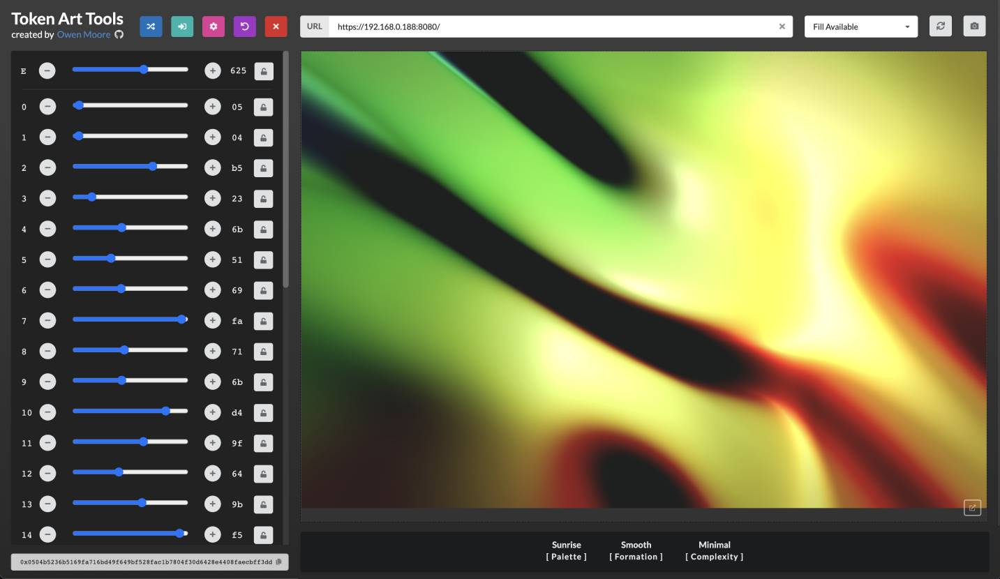

# token-art-tools

Static webapp for generative artists to explore a script's creative domain via sliders mapped to hashpairs, automate image generation for a sample set, and capture features as a CSV for analyzing probability of outcomes. Developed in React using Gatsby and Semantic UI libraries.

https://owenmoore.github.io/token-art-tools/



# Project Configuration

This webapp expects a `localhost` web server hosting your script and that you have referenced the `lib/connector.js` script before executing your sketch. Global variables `hash` and `number` are available for your sketch to use, as well as some platform sepcific implementations.

## Boilerplate Setup

The following boilerplate project setup supports all of Token Art Tool's features

https://github.com/owmoxyz/token-art-tools-boilerplate

## Manual Setup

The `lib/connector.js` script must be referenced in your project before your artwork sketch executes. Either copy it into your repo or use this CDN.

```html
<script src="https://cdn.jsdelivr.net/gh/owmoxyz/token-art-tools@1.6.5/lib/connector.js"></script>
```

## Host Locally

You can run this webapp locally if you want by doing the following:

1. `npm install`
2. `make run-server`
3. `http://localhost:8000`

## Platform Specific Features

### [Art Blocks](https://www.artblocks.io)

The global variable `tokenData` is made available by the `lib/connector.js` script by using the hash directly provided by the webapp. All 32 hashpairs are used in the hash and the edition number simulates project "0" with a possitble edition range of "0 to 1000", smaller than the possible million for practical UI purposes.

```js
tokenData = {
    hash: '0x0000000000000000000000000000000000000000000000000000000000000000',
    tokenId: 1000000,
};
```

Please refer to [Art Block's 101 Docs](https://docs.artblocks.io/creator-docs/creator-onboarding/readme/) for more information.

### [fx(hash)](https://www.fxhash.xyz)

The global variable `fxhash` and function `fxrand` are made available by the `lib/connector.js` script by using a slice of the hash provided by the webapp. The script simply overrides the code snippet required by the fx(hash) creator minting process. If you are including this snippet in your project setup (recommended), please ensure that the reference to `lib/connector.js` is made **AFTER** the fx(hash) code snippet to have them properly overriden. Also, please don't forget to remove it when you are ready to mint.

```js
fxhash = 'oo89fd946ca9ce6b038b4434c205da26767bf632748f5cf8292';

console.log('new random number between 0 and 1', fxrand());
```

Please refer to the [fxhash publish docs](https://www.fxhash.xyz/doc/artist/guide-publish-generative-token) for more inforamtion.

## Technical Requirements

### Canvas is Required

Artwork must be displayed within a `canvas` element for all features to work as expected.

### preserveDrawingBuffer: true

The `preserveDrawingBuffer` must be `true` for screenshots to work.

##### ThreeJS

```javascript
let renderer = new THREE.WebGLRenderer({preserveDrawingBuffer: true});
```

##### WebGL

```javascript
const gl = canvas.getContext('webgl', {preserveDrawingBuffer: true});
```

# Tips & Tricks

## Use HTTPS

Some browsers will require that you serve your artwork locally via `https` rather than `http`

## Share Hosted URL & Hash

If your `URL` is publicly accessible, you can share a Token Art Tools initialization by using `url`, `hash` and `number` variables in the URL for the application (click the "shared" button next to the address bar to copy the current to clipboard). Not that a valid `url` is required for anything to be set.

`https://owenmoore.github.io/token-art-tools//?url={URL}&hash={HASH}&number={NUMBER}`

## Hashpairs for Exploration

The hashpair sliders are best used early on while exploring ranges and mixes of different creative features.

```js
function mpd(n, a1, b1, a2, b2) {
    return ((n - a1) / (b1 - a1)) * (b2 - a2) + a2;
}

let hs = [];

for (j = 0; j < 32; j++) {
    hs.push(hash.slice(2 + j * 2, 4 + j * 2));
}

let rns = hs.map(x => {
    return parseInt(x, 16);
});

let features = {
    hue: mpd(rns[0], 0, 255, 0, 360),
    size: mpd(rns[1], 0, 255, 0.5, 1.8),
    offset: mpd(rns[2], 0, 255, -2.0, 2.0),
};
```

## Hash to Seed Randomd

While I have used hashparis directly in projects, I wouldn't recommend it because the hash produced by external services (such as minting on chain) may not produce a sufficient randomization and it's more difficult to control probabilities. The best way to use the `hash` is simply to use it as a seed in a random function you trust.

Below is an excellent Random function [Piter Pasma](https://twitter.com/piterpasma) made available for everyone to use.

```js
let S = Uint32Array.from([0, 0, 0, 0]).map(i => parseInt(hash.substr(i * 8 + 5, 8), 16));

let R = (a = 1) => {
    let t = S[3];
    S[3] = S[2];
    S[2] = S[1];
    let s = (S[1] = S[0]);
    t ^= t << 11;
    S[0] ^= t ^ (t >>> 8) ^ (s >>> 19);
    return (a * S[0]) / 2 ** 32;
};

console.log('random value between 0 and 1', R());

let myArray = ['a', 'b', 'c', 'd'];

console.log('pick from array', myArray[(R() * myArray.length) | 0]);
```

## Longer Delays for Reliable Screenshots & CSV Capture

The automated process can sometimes produce unreliable results, especially if your artwork is particularly taxing. I simply suggest increasing the wait time between capturing and testing on smaller sample sizes before commiting to a larger set to run overnight.

## Define Features as Early as Possible

The `lib/connector.js` script defines a global `features` variable as an empty object which you can then assign key-value pairs to display in the webapp. You must set the features variables no later than `500ms` because the webapp will attempt to retrieve them at about `600ms`.

```js
features = {
    Palette: 'Blue Sky',
    Style: 'Shadow',
};
features['Size'] = 10;
```

You can only assign `int`, `float`, and `string` values as a feature entry.

# Known Issues

-   When using a simple web server (ex: `python -m http.server 5500`), Chrome will block HTML files within iframes. At the time of writing, Firefox will still allow this, but it's much better to simple use a `node` project setup.
